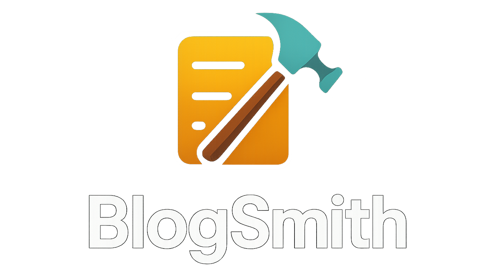
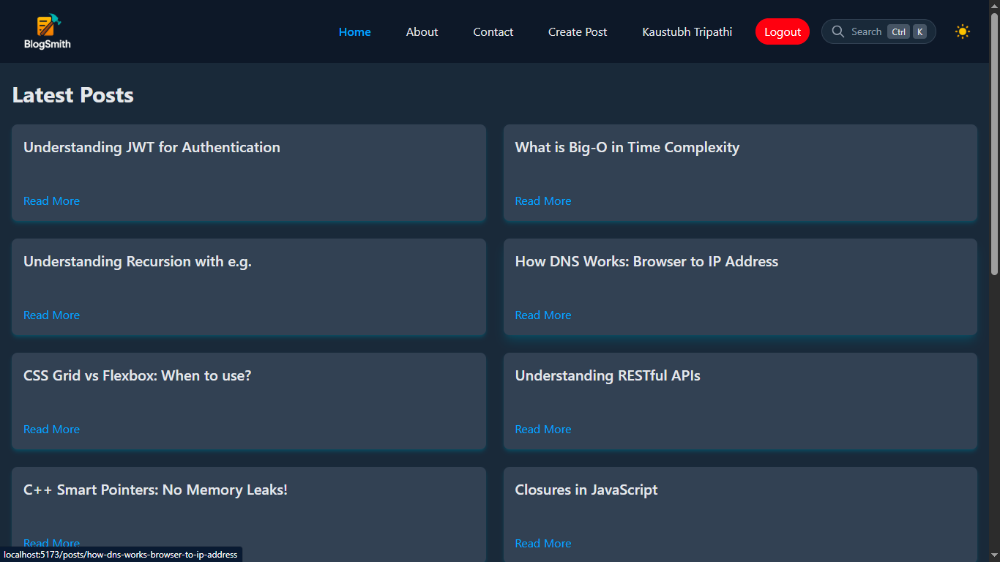
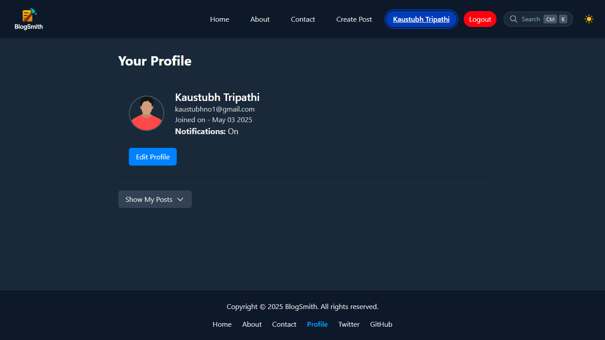
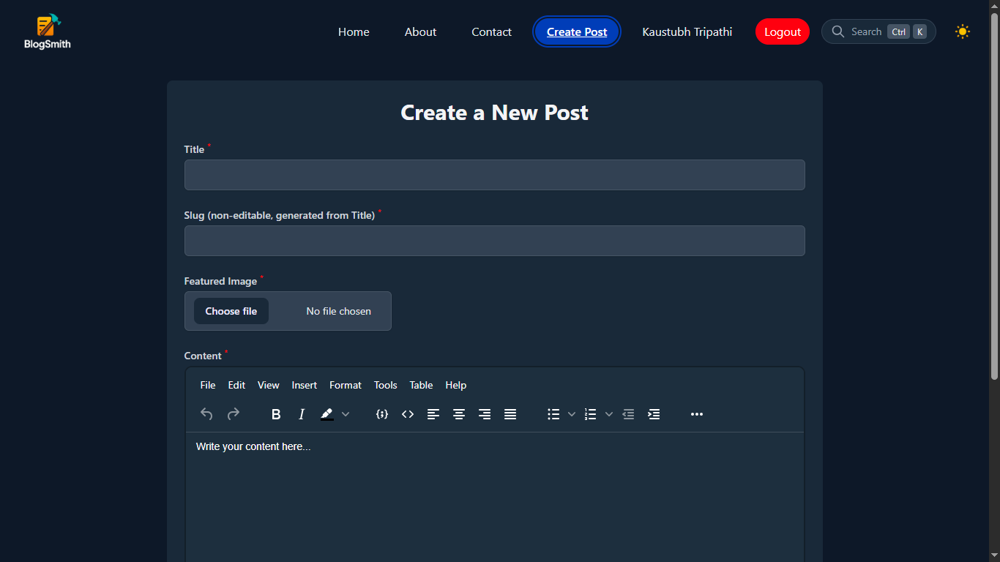

# 🌟 BlogSmith

<!--  -->


Welcome to **BlogSmith**, a sleek and modern blogging platform built with React and Appwrite. Whether you're a writer looking to share your ideas or a reader eager to explore new content, BlogSmith provides a seamless experience to create, read, and manage blog posts effortlessly.

**Note: This repository was created for deployment on Vercel and is a copy of the original project, which was developed over time. You can view the full commit history in the original repository [here](https://github.com/kaustubh-tripathi-1/web-dev/tree/main/React/blog-post).**

---

## 🚀 Features

- **User Authentication**: Secure login and registration with Appwrite.
- **Create & Manage Posts**: Write, edit, and delete blog posts with ease.
- **Infinite Scrolling**: Seamlessly load more posts as you scroll.
- **Responsive Design**: Looks great on all devices, from mobile to desktop.
- **Dark Mode**: Toggle between light and dark themes for a comfortable reading experience.
- **User Profiles**: Manage your profile, preferences, and view your posts.
- **Search Functionality**: Easily find posts with a built-in search modal.
- **Notifications**: Get feedback on actions like post deletion or logout.

---

## 🛠️ Technologies Used

- **`react`**: Frontend library for building the UI.
- **`reduxjs/toolkit`**: State management for a predictable state container.
- **`appwrite`**: Backend-as-a-Service for authentication, database, and storage.
- **`tailwindcss`**: Utility-first CSS framework for styling.
- **`TinyMCE`**: Rich Text Editor with multiple plug-ins (self-hosted).
- **`react-hook-form`**: Seamless form state management.
- **`html-react-parser`**: For parsing html into react components
- **`react-router`**: For navigation and routing.
- **`prism-react-renderer`**: For syntax highlighting.
- **`vite`**: Fast build tool and development server.  

---

## 📦 Installation

Follow these steps to get BlogSmith up and running locally:

### Prerequisites
- **Node.js** (v16 or higher)
- **npm** or **yarn**
- An **Appwrite** instance (self-hosted or cloud)

### Steps
1. **Clone the Repository**
   ``` bash
   git clone https://github.com/kaustubh-tripathi-1/blogsmith.git
   cd blogsmith
   ```

2. **Install Dependencies**
   ``` bash
   npm install
   # or
   yarn install
   ```
    **Important Note: Use --legacy-peer-deps flag to ignore peer dependency conflicts as the used version of tinymce is not fully compatible with react-v19.**

3. **Set Up Appwrite**
   - Create a new project in your Appwrite instance (e.g., named "BlogSmith").
   - Note the **Project ID** and **Endpoint** from the Appwrite Console.
   - Configure the necessary collections and permissions for users and posts (refer to Appwrite docs for details).

4. **Configure Environment Variables**
   Create a `.env` file in the root directory and add your Appwrite configuration:
   ``` env
   VITE_APPWRITE_ENDPOINT=https://cloud.appwrite.io/v1
   VITE_APPWRITE_PROJECT_ID=your_project_id
   ```

5. **Run the Development Server**
   ``` bash
   npm run dev
   # or
   yarn dev
   ```
   Open `http://localhost:5173` (or the port shown in your terminal) to view the app.

---

## 📖 Usage

1. **Sign Up / Log In**
   - Create an account or log in using your credentials to start writing posts.
   - Navigate to `/login` or `/signup` to access the authentication pages.

2. **Create a Post**
   - Once logged in, go to `/create-post` to write a new blog post.
   - Add a title, content, and optional featured image, then publish.

3. **View Your Posts**
   - Visit `/profile` to see your user profile and a list of your posts.
   - Toggle the "Show My Posts" section to view, edit, or delete your posts.

4. **Explore Posts**
   - The homepage (`/`) displays the latest posts with infinite scrolling.
   - Use the search modal (accessible from the header) to find specific posts.

5. **Toggle Theme**
   - Switch between light and dark modes based on your preference (saved in user settings).

---

## 🖼️ Screenshots

### Homepage (with sample posts)


### User Profile


### Create Post


---

## 🤝 Contributing

I’m a beginner developer, and this is a personal project I built to learn and showcase my skills. If you’d like to contribute or have suggestions, I’d love to hear from you! Here’s how you can help:

1. **Fork the Repository**  
   Click the "Fork" button on GitHub to create a copy of this project.

2. **Make Changes**  
   Create a new branch, make your changes, and test them locally.

3. **Submit a Pull Request**  
   Open a pull request on GitHub, and I’ll review your changes. Please include a brief description of what you’ve added or fixed.

Feel free to reach out if you have any questions!

---

## 📜 License

This project is licensed under the MIT License. See the [LICENSE](LICENSE) file for details.

---

## 📧 Contact

Have questions or suggestions? Reach out to me at:
- **Email**: kt40060@gmail.com
- **GitHub Issues**: [Create an Issue](https://github.com/kaustubh-tripathi-1/blogsmith/issues)

---

## 🌟 Acknowledgments

- [Appwrite](https://appwrite.io) for providing an amazing backend-as-a-service.
- [Tailwind CSS](https://tailwindcss.com) for making styling a breeze.
- [React](https://react.dev) and [Redux Toolkit](https://redux-toolkit.js.org) for a powerful frontend experience.

---

**Happy Blogging with BlogSmith!** ✍️